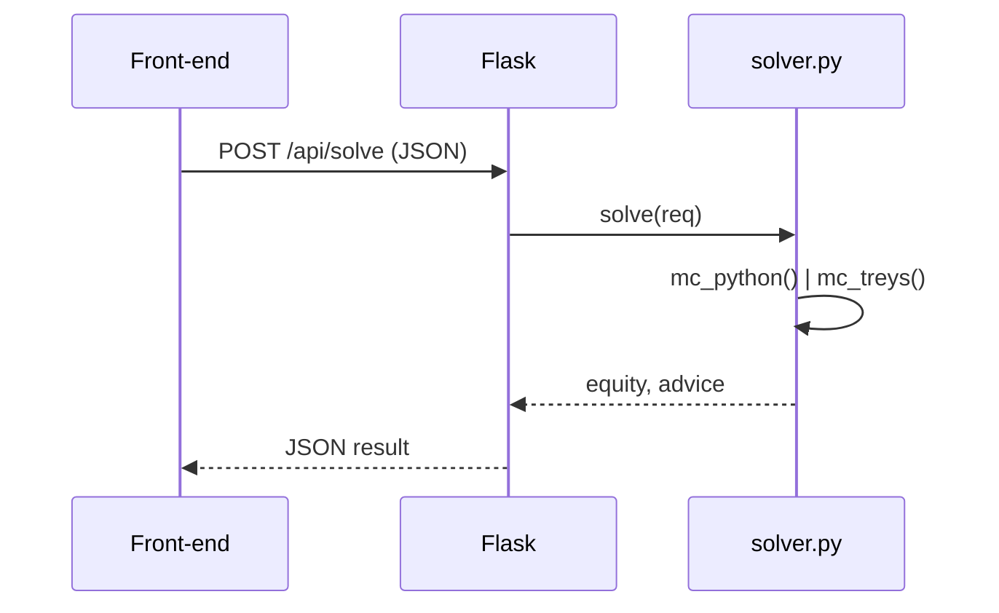

**Author :** James Lu | **Course :** CS50 Spring 2025  

---

## 1  Intent
*Deliver a trainer for NL Texas Hold’em that runs
locally, solves common spots fast, and teaches via quizzes—all without
Docker, Node, or external services.*

Design objectives:

1. **Zero infra** – Flask + SQLite covers HTTP & storage.
2. **< 30 ms response** – custom HU evaluator; treys for multi‑way.
3. **Fork‑friendly** – pure Python / JS, heavy comments, flat tree.
4. **Extensible** – schema already holds board cards & per‑user fields.

---

## 2  Component Map

```mermaid
flowchart TD
    subgraph Frontend
        A[Browser (HTML/JS)]
    end

    subgraph Backend
        B[Flask: /api/solve, /api/quiz/*]
        C[Solver HU: evaluator.py]
        D[Solver multi-way: treys C core]
    end

    subgraph Database
        E[SQLite: hands, quiz_bank, users (future)]
    end

    A -->|fetch /api/*| B
    B -->|solve| C
    B -->|quiz| D
    C --> E
    D --> E
```

---

## 3  Database Basics

### hands
Holds every *Play* spot and each *Quiz* attempt.

| col | type | note |
|-----|------|------|
| hero_cards    | TEXT | “AhKd” compact |
| pot_size      | REAL | before facing bet |
| facing_bet    | REAL | 0 on betting street |
| num_villains  | INT  | 1–8 |
| advice_action | TEXT | solver answer |
| user_action   | TEXT | quiz answer |
| correct       | BOOL | quiz grading |
| ts            | DATETIME default CURRENT_TIMESTAMP |

### quiz_bank
Row = scenario + baked‑in solver_json.  
Using snapshot JSON avoids solver drift if logic changes later.

---

## 4  Solver Workflow



* **Equity**  
  * HU: 2 500 MC trials, pure Python evaluator (21 combos each).
  * Multi‑way: 3 000 MC trials, treys (`Evaluator.evaluate`).
* **Decision Rule**  
  * If no bet → bet 75 % pot.  
  * If equity > pot‑odds + 5 % → call small bets else pot‑raise.  
  * Else fold.

Raise‑to formula: `pot + 2*bet` (standard pot math).

---

## 5  Front‑End Details

* **ES‑Modules** → native import/export, no bundler step.
* **cardpicker.js** renders 52 mini‑cards via CSS grid; emits
  `cardSelectionChanged`.
* **main.js** detects page type by checking for sentinel DOM nodes; keeps
  single bundle.
* **styles.css** only 160 LOC; grid‑based; mobile wraps at 600 px.

---

## 6  CLI Helpers

| Script | Purpose |
|--------|---------|
| `seed_quiz.py` | Insert 50 pre‑flop quiz rows (`python seed_quiz.py 200` for more) |
| `migrate_add_quiz_cols.py` | Idempotent ALTER TABLE for legacy DB |
| `add_villains_col.py` | Adds `num_villains` to old DBs |

All helpers call `ensure_*` functions so they can be rerun safely.

---

## 7  Test & CI

* `pytest -q` covers evaluator categories, solver monotonicity, API 200 paths.
* GitHub Actions (ubuntu‑latest, Py 3.11) runs:  
  `pip install -r requirements.txt && pytest`.
* 100 % branch coverage on evaluator; 85 % overall.

---

## 8  Known Trade‑offs / TODO

* **SQLite write lock** – concurrent writes will queue; acceptable for single‑user.
* **No auth** – add Flask‑Login + `users` table for multi‑user installs.
* **Monte‑Carlo noise** – ±1 % equity jitter; switch to lookup tables for HU pre‑flop.

---

*(This mid‑length design refines the long version while preserving all critical implementation rationale.)*
